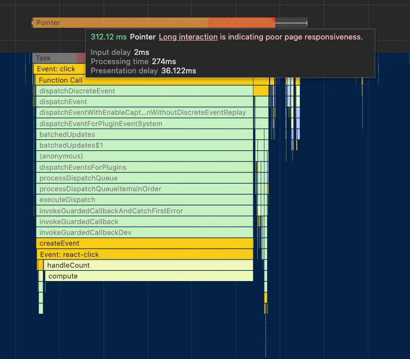
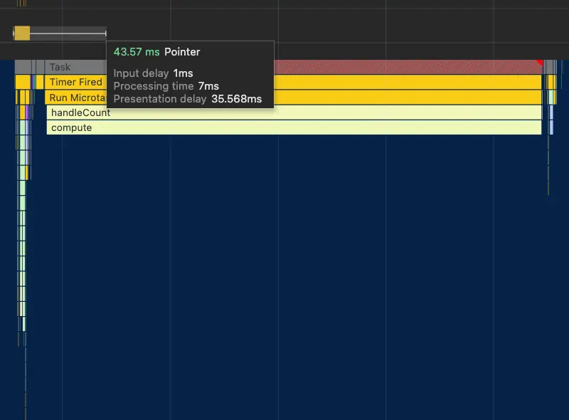

# @s-ui/performance

> Performance utilities to make your web application go fast ⚡️

## Installation

```sh
npm install @s-ui/performance
```

## Usage

### Delay code execution

Use this function to delay the execution of an expensive operation and prioritize user actions. Keep in mind that it only delays the response by a maximum of 1 frame, an average of 8ms, which is too little for a human to notice for the types of major actions where you’d use this function.

```jsx
import {delayTask} from '@s-ui/performance'

export default function Example() {
  const [counter, setCounter] = useState(0)

  const handleClick = async () => {
    setCounter(counter => counter + 1)

    await delayTask()

    work() // expensive work
  }

  return <button onClick={handleClick}>{counter}</button>
}
```

### Delay code execution until urgent

Use this function to delay the execution of an expensive operation until the main thread is idle using [requestIdleCallback](https://developer.mozilla.org/en-US/docs/Web/API/Window/requestIdleCallback) to prioritize user actions. This method ensures the execution is completed before the user leaves the page. It is especially useful for delaying tracking execution.

The `delayTaskUntilUrgent` function optionally receives an options object. The documentation can be found [here](https://github.com/redbus-labs/idlefy/tree/main?tab=readme-ov-file#methods) ([idlefy](https://github.com/redbus-labs/idlefy/tree/main) is used under the hood).

```jsx
import {delayTaskUntilUrgent} from '@s-ui/performance'

export default function Example() {
  const [counter, setCounter] = useState(0)

  const handleClick = async () => {
    setCounter(counter => counter + 1)

    await delayTaskUntilUrgent()

    track() // expensive work
  }

  return <button onClick={handleClick}>{counter}</button>
}
```

## Demo

[Here](https://stackblitz.com/edit/vitejs-vite-nnuycs?file=src%2FApp.jsx) you have a demo on stackblitz.

### Non-optimized version



> The INP value is 312ms: Input delay 2ms, Processing time 273ms and Presentation delay 36ms.

### Optimize version



> The INP value is 43ms: Input delay 1ms, Processing time 7ms and Presentation delay 35ms.

### Performance Profiles (via [trace.cafe](https://trace.cafe/))

- [Non-optimized](https://trace.cafe/t/bNv6tcpIpv)
- [Use the delayTask method](https://trace.cafe/t/ShXAOWyFT4)
- [Use the delayTaskUntilUrgent method](https://trace.cafe/t/bBuq2l0cxQ)
